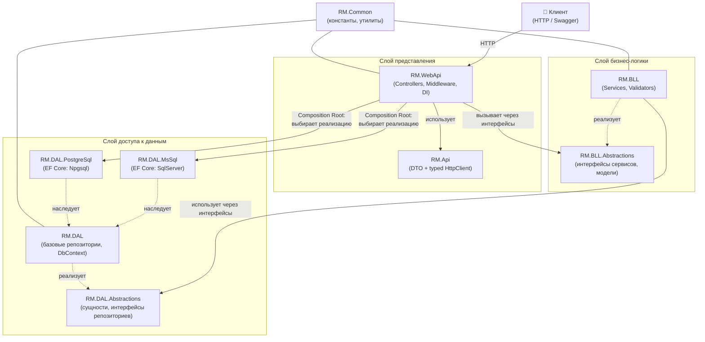
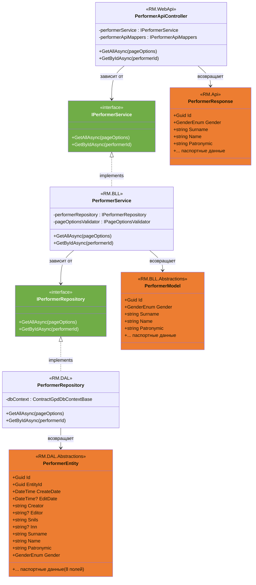
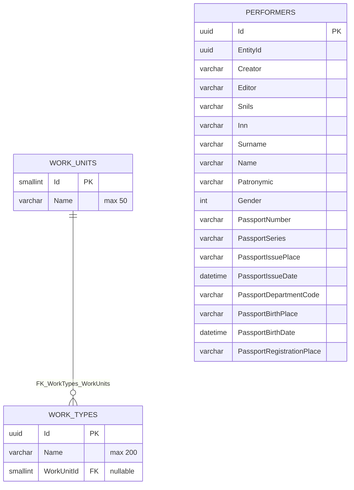
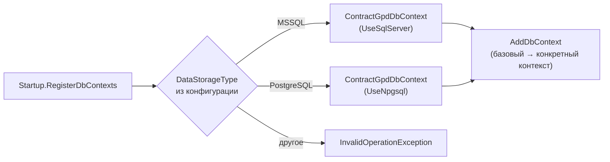

# RM WebApi

ASP.NET Core Web API-приложение (.NET 9) для управления **видами работ** (WorkType), **единицами работ** (WorkUnit) и **исполнителями договоров** (Performer).

> Подробный контекст проекта (для AI-агентов) — см. [KODA.md](KODA.md).

---

## Содержание

1. [Общая архитектура](#общая-архитектура)
2. [Слои и назначение проектов](#слои-и-назначение-проектов)
3. [Диаграмма зависимостей проектов](#диаграмма-зависимостей-проектов)
4. [Поток запроса (Sequence Diagram)](#поток-запроса-sequence-diagram)
5. [UML-диаграмма классов домена Performer](#uml-диаграмма-классов-домена-performer)
6. [Модель данных БД (ER-диаграмма)](#модель-данных-бд-er-диаграмма)
7. [Выбор СУБД](#выбор-субд)
8. [Сборка и запуск](#сборка-и-запуск)
9. [Тестирование](#тестирование)

---

## Общая архитектура

Проект построен по слоистой архитектуре в стиле **Clean Architecture**. Каждый слой знает только о слое *ниже* через его **абстракции** (интерфейсы). Конкретные реализации подключаются только в точке сборки — корневом проекте `RM.WebApi` (Composition Root).



**Ключевые принципы:**

| Принцип | Как реализован |
|---|---|
| Инверсия зависимостей | BLL и DAL зависят от абстракций, а не реализаций |
| Composition Root | Все привязки «интерфейс → реализация» — в `RM.WebApi/Extensions/` (`ServiceCollectionExtensions.cs`) |
| Изоляция контрактов | У каждого слоя свои DTO: `Entity` → `Model` → `Response` |
| Сменяемость СУБД | Выбор MS SQL / PostgreSQL по конфигурации `DataStorageType` |

---

## Слои и назначение проектов

| Проект | Слой | Назначение |
|---|---|---|
| `RM.WebApi` | Presentation | Контроллеры, Startup, DI-регистрации, Swagger, мидлвар ошибок |
| `RM.Api` | Presentation (клиент) | Request/Response DTO, сгенерированный NSwag-клиент |
| `RM.BLL` | Business Logic | Сервисы (`WorkType`, `WorkUnit`, `Performer`), FluentValidation-валидаторы, AutoMapper-профили |
| `RM.BLL.Abstractions` | Business Logic | Интерфейсы сервисов, модели (`PerformerModel`, `PageOptionsModel`), интерфейсы валидаторов |
| `RM.DAL` | Data Access | Базовый `ContractGpdDbContextBase`, базовые реализации репозиториев |
| `RM.DAL.MsSql` | Data Access | Конкретный EF Core DbContext для MS SQL Server |
| `RM.DAL.PostgreSql` | Data Access | Конкретный EF Core DbContext для PostgreSQL |
| `RM.DAL.Abstractions` | Data Access | Сущности (`WorkTypeEntity`, `WorkUnitEntity`, `PerformerEntity`), интерфейсы репозиториев |
| `RM.Common` | Общее | Константы (`DatabaseConstants`, `ApiConstants`), хелперы |
| `RM.BLL.Tests` | Тесты | xUnit-тесты BLL с моками (Moq) |

---

## Диаграмма зависимостей проектов

Направление стрелок — «зависит от». Все зависимости идут строго «вниз», циклов нет.


---

## Поток запроса (Sequence Diagram)

Пример: `GET /api/performer/all?pageNumber=1&pageSize=100`

```mermaid
sequenceDiagram
    autonumber
    actor C as Клиент
    participant MW as ErrorHandlingMiddleware
    participant Ctrl as PerformerApiController<br/>(RM.WebApi)
    participant Svc as PerformerService<br/>(RM.BLL)
    participant Val as PageOptionsValidator<br/>(RM.BLL)
    participant Repo as PerformerRepository<br/>(RM.DAL)
    participant DB as PostgreSQL / MS SQL

    C->>MW: GET /api/performer/all
    MW->>Ctrl: вызов действия GetAllAsync
    Ctrl->>Ctrl: PageOptionsRequest → PageOptionsModel<br/>(IPageOptionsApiMappers)
    Ctrl->>Svc: GetAllAsync(pageOptions)
    Svc->>Val: ValidateAndThrowAsync(pageOptions)
    Val-->>Svc: OK (или ValidationException → 400)
    Svc->>Svc: PageOptionsModel → Shared.PageOptionsModel<br/>(IPageOptionsBllMappers)
    Svc->>Repo: GetAllAsync(pageOptions)
    Repo->>DB: SELECT ... LIMIT/OFFSET (AsNoTracking)
    DB-->>Repo: IReadOnlyCollection&lt;PerformerEntity&gt;
    Repo-->>Svc: entities
    Svc->>Svc: PerformerEntity → PerformerModel<br/>(IPerformerBllMappers)
    Svc-->>Ctrl: IReadOnlyCollection&lt;PerformerModel&gt;
    Ctrl->>Ctrl: PerformerModel → PerformerResponse<br/>(IPerformerApiMappers)
    Ctrl-->>MW: IEnumerable&lt;PerformerResponse&gt;
    MW-->>C: 200 OK (JSON)
```

Обработка ошибок: исключения BLL (`ConflictException`, `DataNotFoundException`, `ValidationException`) перехватываются `ErrorHandlingMiddleware` и преобразуются в соответствующие HTTP-коды (400/404/409/500).

---

## UML-диаграмма классов домена Performer

Сквозной путь данных через слои: `PerformerEntity` → `PerformerModel` → `PerformerResponse`. Каждый класс живёт в своём слое и не зависит от соседних напрямую — связывает их AutoMapper.



---

## Модель данных БД (ER-диаграмма)

База данных `DbContracts` (PostgreSQL / MS SQL):



**Связи:**

- `WorkUnits` (1) ──< `WorkTypes` (M): одна единица работы используется во многих видах работ; `WorkTypes.WorkUnitId` может быть `NULL`.
- `Performers` — самостоятельная сущность (исполнители договоров).

---

## Выбор СУБД

Хранилище выбирается один раз при старте приложения по конфигурации:



Значение `DataStorageType` (`"MSSQL"` / `"PostgreSQL"`) и строки подключения задаются в `appsettings*.json` / User Secrets.

---

## Сборка и запуск

```bash
# Сборка
cd RM
dotnet build RM.sln

# Запуск (Development, порты 5000/5001)
cd RM.WebApi
dotnet run

# Swagger (в Development)
# https://localhost:5001/swagger
```

### Конфигурация

| Параметр | Описание |
|---|---|
| `DataStorageType` | Тип хранилища: `"MSSQL"` или `"PostgreSQL"` |
| `ConnectionStrings:MsSqlDbContractConnection` | Строка подключения к MS SQL |
| `ConnectionStrings:PostgreDbContractConnection` | Строка подключения к PostgreSQL |

---

## Тестирование

```bash
cd RM.BLL.Tests
dotnet test
```

Тесты BLL изолированы от БД: репозитории мокаются через Moq, AutoMapper-профили подключаются реально.