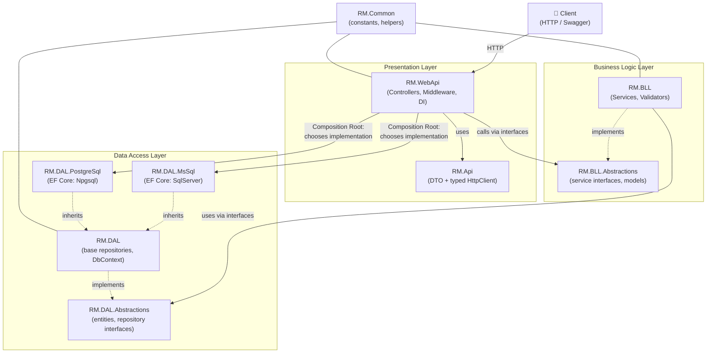
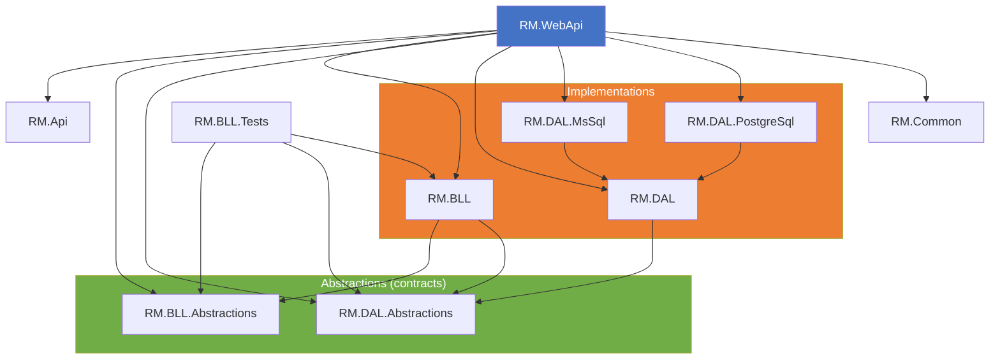
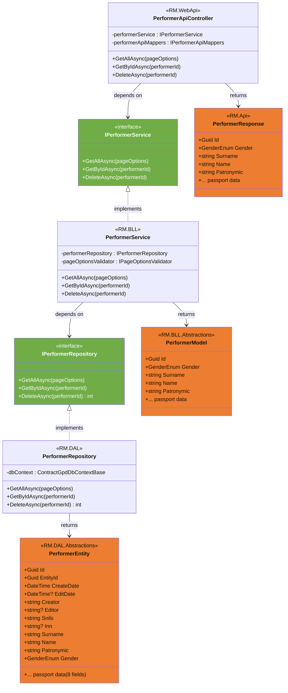
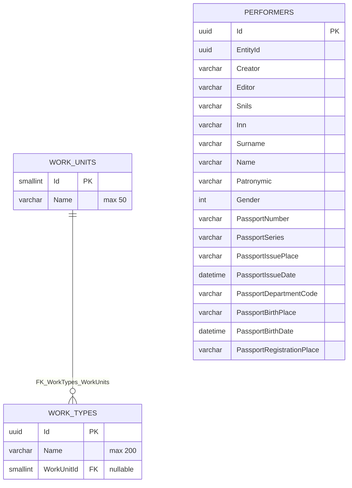
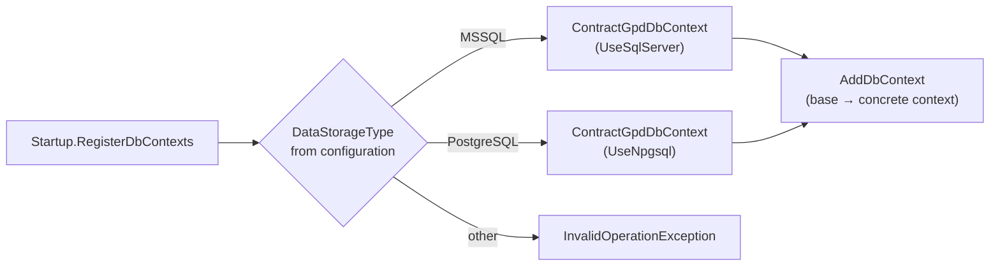

# RM WebApi

ASP.NET Core Web API application (.NET 9) for managing **work types** (WorkType), **work units** (WorkUnit) and **contract performers** (Performer).

---

## Table of Contents

1. [General Architecture](#general-architecture)
2. [Layers and Project Purpose](#layers-and-project-purpose)
3. [Project Dependency Diagram](#project-dependency-diagram)
4. [UML Class Diagram of the Performer Domain](#uml-class-diagram-of-the-performer-domain)
5. [Database Model (ER Diagram)](#database-model-er-diagram)
6. [Database Selection](#database-selection)
7. [Build and Run](#build-and-run)
8. [Testing](#testing)

---

## General Architecture

The project follows a layered **Clean Architecture** style. Each layer only knows about the layer *below* it through its **abstractions** (interfaces). Concrete implementations are wired only at the composition point — the root project `RM.WebApi` (Composition Root).



**Key principles:**

| Principle | How it is implemented |
|---|---|
| Dependency Inversion | BLL and DAL depend on abstractions, not implementations |
| Composition Root | All «interface → implementation» bindings live in `RM.WebApi/Extensions/` (`ServiceCollectionExtensions.cs`) |
| Contract isolation | Each layer has its own DTOs: `Entity` → `Model` → `Response` |
| Swappable database | MS SQL / PostgreSQL is selected via the `DataStorageType` configuration |

---

## Layers and Project Purpose

| Project | Layer | Purpose |
|---|---|---|
| `RM.WebApi` | Presentation | Controllers, Startup, DI registrations, Swagger, error-handling middleware (BLL exceptions → HTTP status codes: 400/404/409/500) |
| `RM.Api` | Presentation (client) | Request/Response DTOs, generated NSwag client |
| `RM.BLL` | Business Logic | Services (`WorkType`, `WorkUnit`, `Performer`), FluentValidation validators, AutoMapper profiles |
| `RM.BLL.Abstractions` | Business Logic | Service interfaces, models (`PerformerModel`, `PageOptionsModel`), validator interfaces |
| `RM.DAL` | Data Access | Base `ContractGpdDbContextBase`, base repository implementations |
| `RM.DAL.MsSql` | Data Access | Concrete EF Core DbContext for MS SQL Server |
| `RM.DAL.PostgreSql` | Data Access | Concrete EF Core DbContext for PostgreSQL |
| `RM.DAL.Abstractions` | Data Access | Entities (`WorkTypeEntity`, `WorkUnitEntity`, `PerformerEntity`), repository interfaces |
| `RM.Common` | Shared | Constants (`DatabaseConstants`, `ApiConstants`), helpers |
| `RM.BLL.Tests` | Tests | xUnit tests for BLL with mocks (Moq) |

---

## Project Dependency Diagram

Arrow direction means «depends on». All dependencies point strictly «downward», there are no cycles.



---

## UML Class Diagram of the Performer Domain

End-to-end data path through the layers: `PerformerEntity` → `PerformerModel` → `PerformerResponse`. Each class lives in its own layer and does not depend on its neighbors directly — AutoMapper connects them.



---

## Database Model (ER Diagram)

The `DbContracts` database (PostgreSQL / MS SQL):



**Relationships:**

- `WorkUnits` (1) ──< `WorkTypes` (M): one work unit is used by many work types; `WorkTypes.WorkUnitId` can be `NULL`.
- `Performers` — a standalone entity (contract performers).

---

## Database Selection

The storage backend is selected once at application startup from configuration:



The `DataStorageType` value (`"MSSQL"` / `"PostgreSQL"`) and connection strings are set in `appsettings*.json` / User Secrets.

---

## Build and Run

```bash
# Build
cd RM
dotnet build RM.sln

# Run (Development, ports 5000/5001)
cd RM.WebApi
dotnet run

# Swagger (in Development)
# https://localhost:5001/swagger
```

### Configuration

| Setting | Description |
|---|---|
| `DataStorageType` | Storage type: `"MSSQL"` or `"PostgreSQL"` |
| `ConnectionStrings:MsSqlDbContractConnection` | MS SQL connection string |
| `ConnectionStrings:PostgreDbContractConnection` | PostgreSQL connection string |

---

## Testing

```bash
cd RM.BLL.Tests
dotnet test
```

BLL tests are isolated from the database: repositories are mocked with Moq, while AutoMapper profiles are used for real.